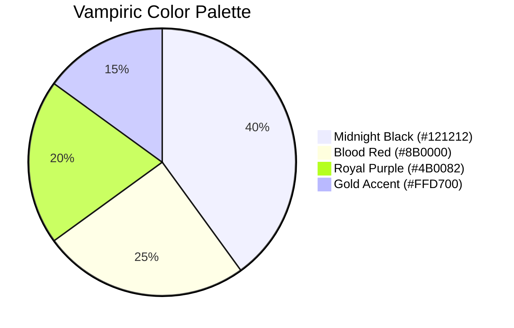

# Persona Bot Vampiric Theme Refactoring Plan

## 1. Dark Gothic Design System

### Color Scheme

- **Base**: Midnight black (#121212) for dark backgrounds
- **Primary**: Blood red (#8B0000) for main accents
- **Secondary**: Royal purple (#4B0082) for secondary elements
- **Accent**: Gold (#FFD700) for highlights and important info

### Typography
- **Titles**: Gothic-style fonts with emoji decor (🦇🧛‍♂️)
- **Body**: Clean, high-contrast text with generous spacing
- **Fields**: Elegant borders with subtle texture

## 2. Embed Message Types

| Message Type       | Color        | Style Elements                     |
|--------------------|--------------|------------------------------------|
| Status             | Blood Red    | Bat icon, gothic borders           |
| Help               | Royal Purple | Candlelight glow effect            |
| Welcome            | Gold         | Animated blood drip effect         |
| Error              | Dark Crimson | Broken glass texture               |
| Warning            | Orange-Red   | Flickering torch animation         |

## 3. Visual Enhancements
1. **Textures**: Subtle parchment/batwing textures
2. **Icons**: Custom vampiric emojis (🦇🧛‍♂️🩸)
3. **Animations**: 
   - Gentle fade-ins
   - Blood drip effects for important alerts
4. **Layout**:
   - Asymmetrical gothic frames
   - Ornamental borders